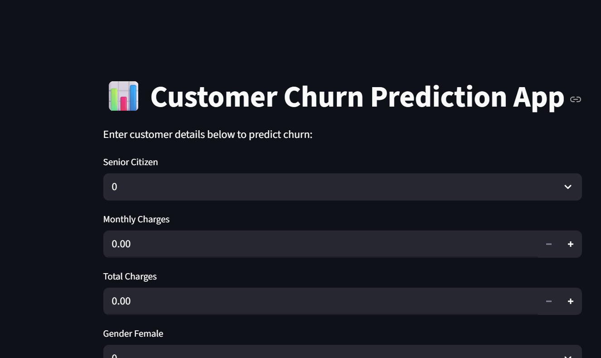

# 🚀 Customer Churn Prediction App

Predict whether a customer will **leave your service** using a **machine learning model**!  
Built with **Python**, **Streamlit**, and **scikit-learn**.

---



---

## 🌟 Features

- Predict customer churn in **real-time**  
- User-friendly **interactive web interface**  
- Built on **Random Forest Classifier**  
- Works with multiple customer attributes  

---

## 🛠 Installation

1. Clone the repository:

```bash
git clone https://github.com/kiran848/Customer-churn-prediction.git
cd Customer-churn-prediction
````

2. Create a virtual environment (optional):

```bash
python -m venv venv
```

3. Activate environment:

* **Windows:** `venv\Scripts\activate`
* **Linux/Mac:** `source venv/bin/activate`

4. Install dependencies:

```bash
pip install -r requirements.txt
```

---

## ⚡ Run the App

```bash
streamlit run app.py
```

Open your browser and input customer data to get churn prediction instantly.

---

## 📂 Repository Structure

| File                              | Description                    |
| --------------------------------- | ------------------------------ |
| `app.py`                          | Main Streamlit app             |
| `churn_model.pkl`                 | Pre-trained model              |
| `model_columns.pkl`               | Columns used in model training |
| `Customer_churn_prediction.ipynb` | EDA & preprocessing            |
| `Model_churn_prediction.ipynb`    | Model training & evaluation    |
| `Churn-Data.csv`                  | Dataset                        |
| `requirements.txt`                | Python dependencies            |

---

## 📈 Model

* **Algorithm:** Random Forest Classifier
* **Libraries:** scikit-learn, joblib, pandas, numpy
* **Input:** Customer attributes
* **Output:** Churn prediction (Yes/No)

---

## 🔗 Live Demo

[Streamlit Cloud Deployment](https://kiran848-customer-churn-prediction-app-dmnw67.streamlit.app/)

---

## 👨‍💻 Author

**Kiran848** – Final Year BTech, Mody University
GitHub: [https://github.com/kiran848](https://github.com/kiran848)

---


